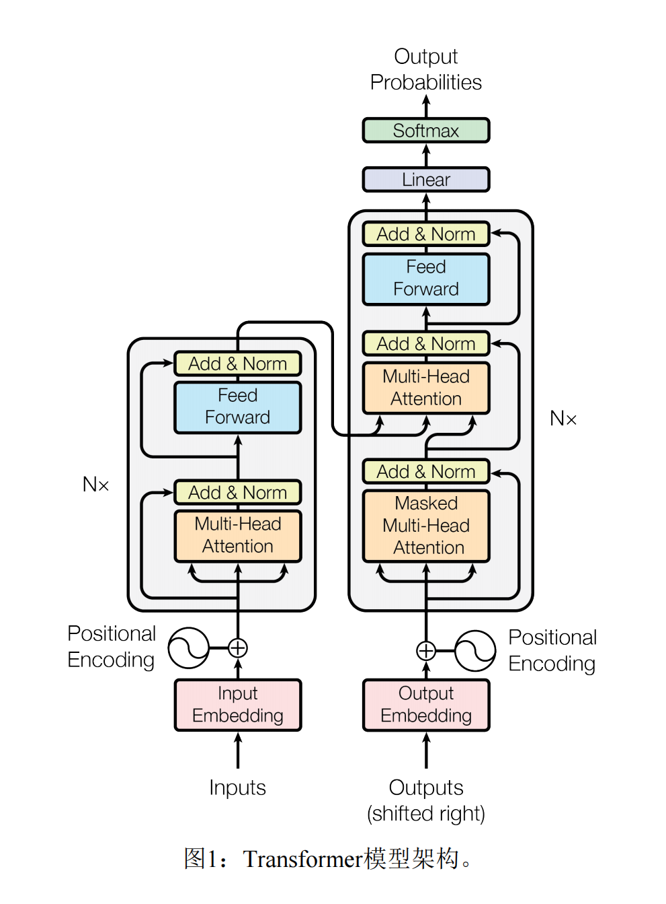

# 一、概述

在 Transformer 出现之前，主流的序列转导模型（如机器翻译）基于复杂的**循环神经网络**或**卷积神经网络**，并且通常都包含一个编码器和一个解码器。

然而，RNN 固有的**顺序计算**特性存在明显瓶颈：

- **训练速度慢**：无法并行处理序列，难以利用现代GPU的强大算力。
- **长程依赖问题**：尽管有 LSTM、GRU 等改进，模型仍难以有效处理长序列中远距离元素之间的关系。

**Transformer 的提出**，完全摒弃了循环结构，**仅依赖自注意力机制**来计算输入和输出的表示，实现了完全并行化训练，并在翻译质量和训练成本上取得了显著提升。

# 二、整体架构

Transformer 模型遵循编码器-解码器架构，其整体数据流与结构如下图所示(论文中的图片)：



- **编码器**（左）：由 N 个相同的层堆叠而成，负责将输入序列映射为一个富含上下文信息的连续表示。
- **解码器**（右）：同样由 N 个相同的层堆叠而成，负责根据编码器的输出和已生成的部分，自回归地生成目标序列。

# 三、核心模块详解

### 输入嵌入与位置编码

1. **输入嵌入**

   - 将输入中的每个令牌（单词或子词）转换成一个固定维度的向量（例如 `d_model = 512`）。
   - 该向量能够捕获令牌的语义信息。

2. **位置编码（）**

   - 由于 Transformer 不含循环和卷积，它本身无法感知序列的顺序。位置编码被注入到嵌入向量中，为模型提供令牌的位置信息。

   - 使用不同频率的正弦和余弦函数来生成位置编码：
     $PE_{(pos, 2i)} = \sin\left(\frac{pos}{10000^{2i/d_{\text{model}}}}\right)$

     $PE_{(pos, 2i+1)} = \cos\left(\frac{pos}{10000^{2i/d_{\text{model}}}}\right)$

   - 其中 `pos` 是位置，`i` 是维度索引。

### 自注意力机制

自注意力机制允许序列中的每个位置都能够关注序列中的所有位置，从而计算出一个包含全局上下文的表示。

**计算步骤：**

1. **投影**：对每个输入向量，使用三个不同的权重矩阵（$W_Q$, $W_K$, $W_V$）线性投影，生成**查询向量q**、**键向量k**和**值向量v**。
2. **计算分数**：通过计算查询向量与所有键向量的点积，得到注意力分数。分数越高，表示对应位置越值得关注。
3. **缩放与 Softmax**：将分数除以 ${\sqrt{d_k}}$（键向量的维度），然后应用 Softmax 函数，得到归一化的权重（总和为 1）。
4. **加权求和**：将 Softmax 输出的权重与对应的值向量相乘并求和，得到该位置的输出向量。

**公式：**

$\text{Attention}(Q, K, V) = \text{softmax}\left(\frac{QK^T}{\sqrt{d_k}}\right)V$

### 多头注意力

- 将查询、键、值投影到不同的、维度更低的子空间（头）上，**并行地**执行自注意力计算。
- 允许模型共同关注来自不同表示子空间的信息（例如，语法、语义、指代关系）。
- 将所有头的输出拼接起来，再通过一个线性层投影回原始维度。

**公式：**
$\text{MultiHead}(Q, K, V) = \text{Concat}(\text{head}_1, \ldots, \text{head}_h)W^O$
$\text{where head}_i = \text{Attention}(QW_i^Q, KW_i^K, VW_i^V)$

### 位置式前馈神经网络

这是一个应用于**每个位置**的独立的全连接前馈网络，由两个线性变换和一个激活函数组成。

$\text{FFN}(x) = \max(0, xW_1 + b_1)W_2 + b_2$

- 通常中间层的维度更大（例如 `d_ff = 2048`），形成一个“瓶颈”结构。
- 其作用是对自注意力层输出的表示进行非线性变换和特征增强。

### 编码器层

每个编码器层包含两个子层：

1. **多头自注意力层**
2. **位置式前馈神经网络层**

每个子层周围都有一个**残差连接**，后接**层归一化**。

- $\text{Output} = \text{LayerNorm}(x + \text{Sublayer}(x))$
- 残差连接有助于缓解深度网络中的梯度消失问题。
- 层归一化稳定了训练过程。

### 解码器层

每个解码器层包含**三个**子层：

1. **掩码多头自注意力层**：确保在生成每个令牌时，只能关注到该位置之前的所有已生成令牌，防止信息泄露。这是通过一个掩码（mask）实现的。
2. **多头编码器-解码器注意力层**：
   - **Query** 来自解码器上一层的输出。
   - **Key 和 Value** 来自**编码器的最终输出**。
   - 这使得解码器在生成每个词时，都能“查阅”源序列中最相关的信息。
3. **位置式前馈神经网络层**：与编码器中的相同。

同样，每个子层都配有残差连接和层归一化。

# 四、简单示例

因为懒得找数据集，所以下面采用的模拟数据，翻译效果肯定不好

```python
import torch.nn
from torch import Tensor
from torch.utils.data import Dataset, DataLoader

#模拟数据
english_sentences = [
    "i love you",
    "he is a student",
    "she likes apples",
    "we play football",
    "this is a book",
]

german_sentences = [
    "ich liebe dich",
    "er ist ein student",
    "sie mag äpfel",
    "wir spielen fussball",
    "dies ist ein buch",
]
class model(torch.nn.Module):
    def __init__(self,vocab_size,d_model,
                 nhead,
                 num_encoder_layers,
                 num_decoder_layers,
                 dropout,
                 batch_first):
        super().__init__()
        self.transform=torch.nn.Transformer(d_model=d_model,
                                            nhead=nhead,
                                            num_encoder_layers=num_encoder_layers,
                                            num_decoder_layers=num_decoder_layers,
                                            dropout=dropout,
                                            batch_first=batch_first)
        self.full_con=torch.nn.Linear(d_model,vocab_size)
        self.emmbedding=torch.nn.Embedding(vocab_size,d_model)

    def forward(self,src:Tensor,tgt:Tensor):
        src=self.emmbedding(src)
        tgt=self.emmbedding(tgt)
        output=self.transform(src,tgt)
        return self.full_con(output)
    

def build_vocab(sentences):
    chars = set()
    for s in sentences:
        for c in s:
            chars.add(c)
    chars = sorted(list(chars))

    vocab = ["<pad>", "<bos>", "<eos>", "<unk>"] + chars
    stoi = {c:i for i,c in enumerate(vocab)}
    itos = {i:c for i,c in enumerate(vocab)}
    return vocab, stoi, itos

vocab_src, stoi_src, itos_src = build_vocab(english_sentences)
vocab_tgt, stoi_tgt, itos_tgt = build_vocab(german_sentences)

PAD_IDX = stoi_src["<pad>"]


def encode(text, stoi):
    return [stoi["<bos>"]] + [stoi.get(c, stoi["<unk>"]) for c in text] + [stoi["<eos>"]]

class ToyTranslateDataset(Dataset):
    def __init__(self, src_list, tgt_list):
        self.src_list = src_list
        self.tgt_list = tgt_list

    def __len__(self):
        return len(self.src_list)

    def __getitem__(self, i):
        src = torch.tensor(encode(self.src_list[i], stoi_src))
        tgt = torch.tensor(encode(self.tgt_list[i], stoi_tgt))
        return src, tgt

def collate_fn(batch):
    src_batch, tgt_batch = [], []
    for src, tgt in batch:
        src_batch.append(src)
        tgt_batch.append(tgt)

    src_batch = torch.nn.utils.rnn.pad_sequence(src_batch, batch_first=True, padding_value=PAD_IDX)
    tgt_batch = torch.nn.utils.rnn.pad_sequence(tgt_batch, batch_first=True, padding_value=PAD_IDX)
    return src_batch, tgt_batch

dataset = ToyTranslateDataset(english_sentences, german_sentences)
loader = DataLoader(dataset, batch_size=2, shuffle=True, collate_fn=collate_fn)


device = "cuda" if torch.cuda.is_available() else "cpu"

model = model(
    vocab_size=len(vocab_tgt),
    d_model=64,
    nhead=4,
    num_encoder_layers=2,
    num_decoder_layers=2,
    dropout=0.1,
    batch_first=True
).to(device)

criterion = torch.nn.CrossEntropyLoss(ignore_index=PAD_IDX)
optim = torch.optim.Adam(model.parameters(), lr=1e-3)

epoches=40
for epoch in range(epoches):
    for src, tgt in loader:
        src = src.to(device)
        tgt = tgt.to(device)

        tgt_input = tgt[:, :-1]    # decoder 输入
        tgt_out   = tgt[:, 1:]     # 训练目标

        logits = model(src, tgt_input)    # (B, T, vocab)

        loss = criterion(
            logits.reshape(-1, len(vocab_tgt)),
            tgt_out.reshape(-1)
        )

        optim.zero_grad()
        loss.backward()
        optim.step()

    print(f"epoch {epoch} loss = {loss.item():.4f}")

def translate(model, sentence, max_len=50, device="cuda"):
    model.eval()
    
    # 1) 把英文编码成ID
    src = torch.tensor(encode(sentence, stoi_src)).unsqueeze(0).to(device)  # (1, S)
    
    # 2) 翻译时 decoder 需要从 <bos> 开始
    tgt = torch.tensor([stoi_tgt["<bos>"]], device=device).unsqueeze(0)     # (1, 1)

    for _ in range(max_len):
        # 模型输出
        output = model(src, tgt)       # (1, T, vocab)
        next_token = output[:, -1, :]  # 取最后一个时间步
        
        # greedy：取概率最高的 token
        next_id = next_token.argmax(dim=-1).item()
        
        # 追加到序列
        tgt = torch.cat([tgt, torch.tensor([[next_id]], device=device)], dim=1)

        # 遇到 <eos> 结束
        if next_id == stoi_tgt["<eos>"]:
            break

    # 移除 <bos>，并转成字符串
    ids = tgt[0].tolist()
    words = [itos_tgt[i] for i in ids]
    return "".join(words[1:-1])   # 去掉 <bos> 和 <eos>


sentence = "i love you"
result = translate(model, sentence)
print("英文：", sentence)
print("德文：", result)
```


