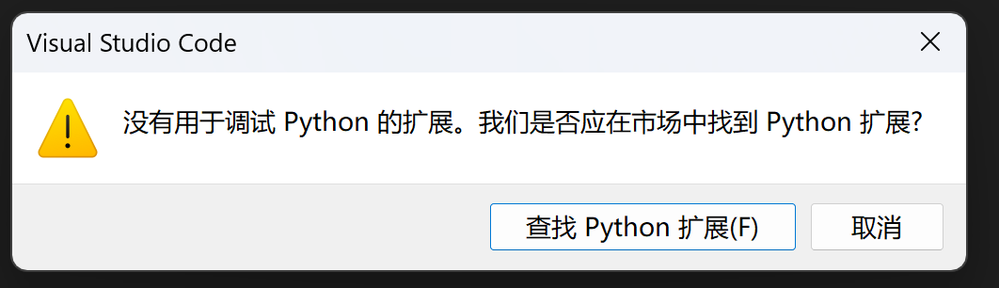
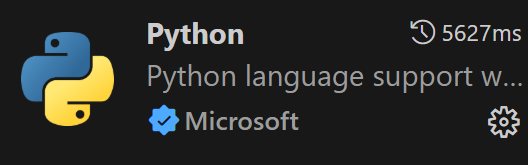
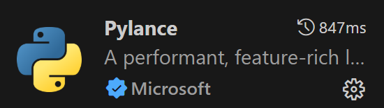
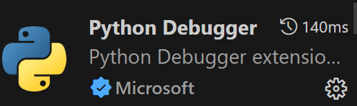
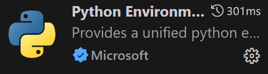
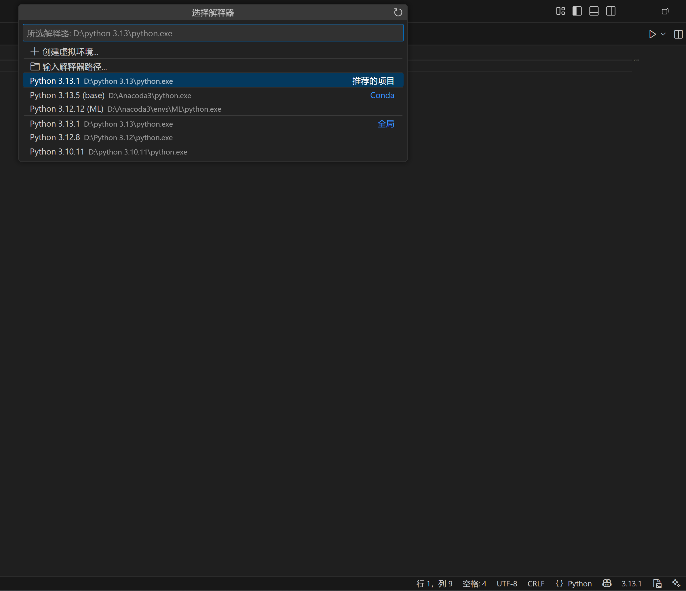
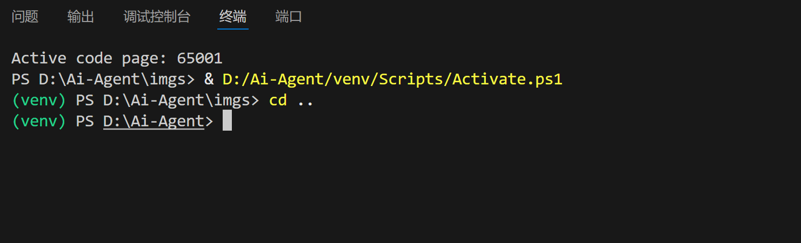
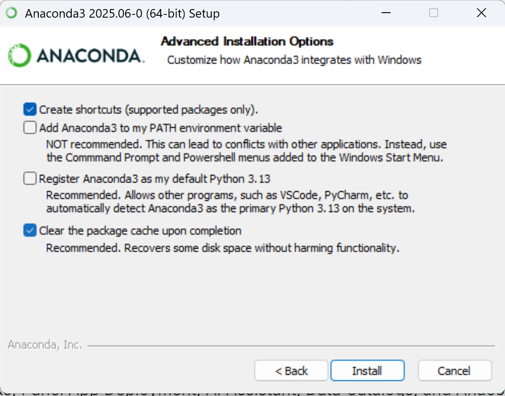

# 一、python下载

1、首先我们需要从官网下载python,（下载地址）[[下载Python |Python.org](https://www.python.org/downloads/)]

2、建议自定义下载路径，下载完成后，启动安装程序即可，记得在安装过程中勾选Add python x.x to PATH

在这里安装完成之后，你会发现python的环境变量有有两个，python、python\Scripts，前者是解释器python3.exe的路径，后者则是pip的路径

3、验证是否安装完成，在cmd中输入一下指令：

```shell
python --version
```

如果返回的是对应的python版本，那么就安装成功了

4、允许脚本的运行：

由于windows的执行策略限制了脚本运行，所以首次运行需要更改执行策略

首先使用管理员方式打开cmd。然后输入一下指令:

```shell
Set-ExecutionPolicy RemoteSigned -Scope CurrentUser
```

# 二、vscode下载与配置

1、首先，下载vscode,(下载网址)[https://code.visualstudio.com/]

2、你要注意。vscode是一款编辑器，也就是说，它本身是不能进行编译的，但依托于他强大的插件生态，vscode已经有非常完美的功能，你在没有插件的情况下运行，会出现如下弹窗



3、接着你需要下载配套的python插件：



这是必需插件，此外还推荐下载以下插件：







之后我们点击运行之后会让我们选择环境，我们任意选择一个即可。你也可以点击右下方版本信息（图示中3.13.1）切换解释器，这个可以解决我们最常见的一个问题：解释器环境和项目环境不一致（终端显示你下载了这个包，但是你导入不了，一般就是这种情况）



# 三、包管理器pip

python作为强大的脚本语言，可以下载各种各样的依赖，但是如果手动从网上下载就显得很繁琐，这里就可以用到我们的python包管理器pip来下载依赖，下面是一些基本的指令

```python
pip list #查看环境下的所有依赖
pip install package-name==version #下载version版本名为package-name的包
pip uninstall package-name #卸载名为package-name的包
pip install -r requirements.txt #从依赖文件批量安装包
pip install package==version -i url #换源安装
```

除此之外还要一些其他的参数和指令，不用记住，使用时用pip -h查看或者上网搜索即可

如果遇到了权限不够的情况，可以使用管理员权限打开，下载速度过慢可以使用换源或者科学的方法解决

# 四、虚拟环境

python作为一个对版本要求很严格的语言，虚拟环境就是为了隔离不同版本的python,说白了，就是为每一个项目配置一个专用的环境。

接下来讲讲如何创建python的虚拟环境吧

```python
python -m venv venv-name #创建虚拟环境
.venv/Scripts/activate #激活虚拟环境
```

激活完成虚拟环境之后你所有的依赖就是下载在项目的虚拟环境下，当你终端的显示是这样的时候就说明激活完成了(有venv这个标识)，



后续如果出现了解释器环境与项目环境不一致的问题，参照前文解决

# 五、anaconda环境配置

anaconda作为一个工具箱，既可以创建独立的python环境，也可以使用内置的conda包管理器下载python包和非python包

对于数据科学以及现在兴起的机器学习领域，推荐使用anaconda

## 1、anaconda下载

[Anaconda下载地址](https://www.anaconda.com/download)

一直点next直到下面界面，按照如图勾选



最后点击下载即可

下载完成之后，需要将根目录，Scripts,Library/bin目录添加到环境变量

最后，记得在根目录创建envs和pkgs文件夹，然后打开.condarc，修改虚拟环境的存储路径

```yaml
envs_dirs:
  - <新的envs存储路径>
pkgs_dirs:
  - <新的pkgs存储路径>
```

## 2、创建虚拟环境

- 使用命令创建虚拟环境

```
conda create -n 环境名 python=版本号
```

比如你像创建机器学习的环境，你可以这样

```
conda create -n ML python=3.12
```

- 激活虚拟环境

```
conda activate 环境名
```

然后你就可以使用anaconda的虚拟环境了

- 退出虚拟环境

```
conda deactivate
```

