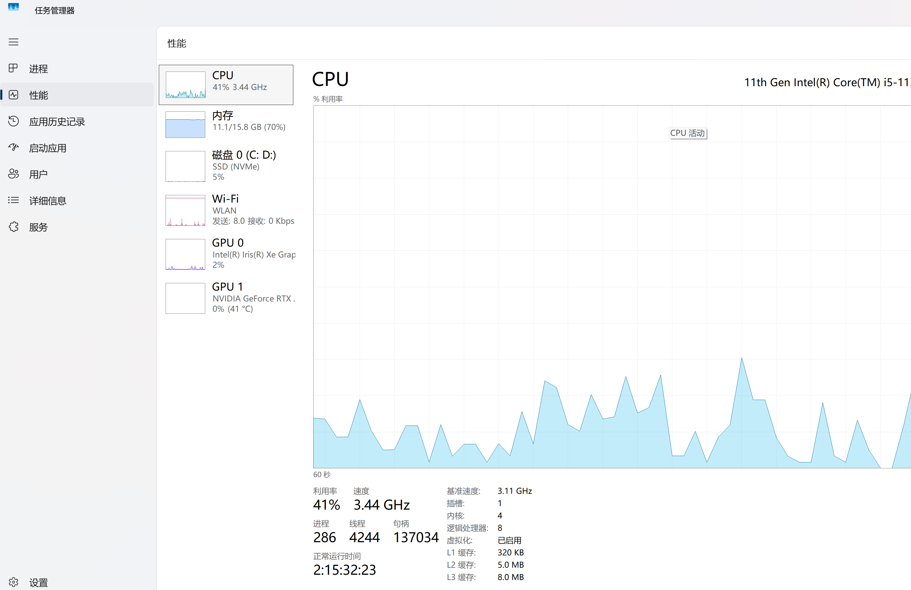

# 一、python下载

1、首先我们需要从官网下载python,（下载地址）[[下载Python |Python.org](https://www.python.org/downloads/)]

2、建议自定义下载路径，下载完成后，启动安装程序即可，记得在安装过程中勾选Add python x.x to PATH

在这里安装完成之后，你会发现python的环境变量有有两个，python、python\Scripts，前者是解释器python3.exe的路径，后者则是pip的路径

3、验证是否安装完成，在cmd中输入一下指令：

```shell
python --version
```

如果返回的是对应的python版本，那么就安装成功了

4、允许脚本的运行：

由于windows的执行策略限制了脚本运行，所以首次运行需要更改执行策略

首先使用管理员方式打开cmd。然后输入一下指令:

```shell
Set-ExecutionPolicy RemoteSigned -Scope CurrentUser
```

# 二、vscode下载与配置

1、首先，下载vscode,(下载网址)[https://code.visualstudio.com/]

2、你要注意。vscode是一款编辑器，也就是说，它本身是不能进行编译的，但依托于他强大的插件生态，vscode已经有非常完美的功能，你在没有插件的情况下运行，会出现如下弹窗


3、接着你需要下载配套的python插件：


这是必需插件，此外还推荐下载以下插件：


之后我们点击运行之后会让我们选择环境，我们任意选择一个即可。你也可以点击右下方版本信息（图示中3.13.1）切换解释器，这个可以解决我们最常见的一个问题：解释器环境和项目环境不一致（终端显示你下载了这个包，但是你导入不了，一般就是这种情况）


# 三、包管理器pip

python作为强大的脚本语言，可以下载各种各样的依赖，但是如果手动从网上下载就显得很繁琐，这里就可以用到我们的python包管理器pip来下载依赖，下面是一些基本的指令

```python
pip list #查看环境下的所有依赖
pip install package-name==version #下载version版本名为package-name的包
pip uninstall package-name #卸载名为package-name的包
pip install -r requirements.txt #从依赖文件批量安装包
pip install package==version -i url #换源安装
```

除此之外还要一些其他的参数和指令，不用记住，使用时用pip -h查看或者上网搜索即可

如果遇到了权限不够的情况，可以使用管理员权限打开，下载速度过慢可以使用换源或者科学的方法解决

# 四、虚拟环境

python作为一个对版本要求很严格的语言，虚拟环境就是为了隔离不同版本的python,说白了，就是为每一个项目配置一个专用的环境。

接下来讲讲如何创建python的虚拟环境吧

```python
python -m venv venv-name #创建虚拟环境
.venv/Scripts/activate #激活虚拟环境
```

激活完成虚拟环境之后你所有的依赖就是下载在项目的虚拟环境下，当你终端的显示是这样的时候就说明激活完成了(有venv这个标识)，


后续如果出现了解释器环境与项目环境不一致的问题，参照前文解决

# 五、anaconda环境配置

anaconda作为一个工具箱，既可以创建独立的python环境，也可以使用内置的conda包管理器下载python包和非python包

对于数据科学以及现在兴起的机器学习领域，推荐使用anaconda

## 1、anaconda下载

[Anaconda下载地址](https://www.anaconda.com/download)

一直点next直到下面界面，按照如图勾选


最后点击下载即可

下载完成之后，需要将根目录，Scripts,Library/bin目录添加到环境变量

最后，记得在根目录创建envs和pkgs文件夹，然后打开.condarc，修改虚拟环境的存储路径

```yaml
envs_dirs:
  - <新的envs存储路径>
pkgs_dirs:
  - <新的pkgs存储路径>
```

## 2、创建虚拟环境

- 使用命令创建虚拟环境

```
conda create -n 环境名 python=版本号
```

比如你像创建机器学习的环境，你可以这样

```
conda create -n ML python=3.12
```

- 激活虚拟环境

```
conda activate 环境名
```

然后你就可以使用anaconda的虚拟环境了

- 退出虚拟环境

```
conda deactivate
```


# 六、wsl环境配置

## 1、何谓wsl

wsl即Windows Subsystem for Linux，是 Windows 系统内置的 Linux 子系统，让你能在windows上使用linux环境

他依赖底层的依赖 Hyper-V虚拟化平台，使你的windows系统成为了一个大型的虚拟机，而linux成为了另外一个虚拟机，两者在用户空间可以直接通信。

| 层级     | Windows 侧组件        | Linux 侧组件（WSL2）  | 交互关系                     |
| -------- | --------------------- | --------------------- | ---------------------------- |
| 用户空间 | Windows 应用程序      | Linux 命令 / 程序     | 各自独立，通过系统调用互通   |
| 内核层   | Windows 内核          | 独立 Linux 内核       | 均依赖 Hypervisor 虚拟化平台 |
| 虚拟化层 | Hypervisor（Hyper-V） | Hypervisor（Hyper-V） | 统一资源调度，隔离双内核环境 |

## 2、前提

- 开启虚拟化（电脑默认开启）

检查方式：win+x打开任务管理器,选择性能-CPU，然后下方有一个虚拟化，若显示已开启，那就正确



若显示未启用，则需进入Bios进行设置，

在 BIOS（或 UEFI）里开启虚拟化，一般称为 **Intel VT-x** 或 **AMD-V**。下面是一个通用步骤，不同品牌按键和菜单名字可能略有不同。

###  重启电脑并进入 BIOS/UEFI

开机时按以下其一（不同品牌不同）：

| 品牌 | 常用进入 BIOS 按键 |
| ---- | ------------------ |
| 通用 | **Del** 或 **F2**  |
| 联想 | F1 / F2 / Fn+F2    |
| 华硕 | F2 / Del           |
| 惠普 | Esc → F10          |
| 戴尔 | F2                 |

> 提示：看到品牌 logo 时迅速连续按。

###  找到虚拟化设置（关键词）

进入 BIOS 后，按方向键或鼠标导航，找到以下菜单之一：

可能在的菜单名称如下：

- **Advanced**（高级）
- **Advanced BIOS Features**
- **CPU Configuration**
- **System Configuration**
- **Security → Virtualization**
- **Advanced → SVM Mode**（AMD）

你要找的选项名字可能是：

| 处理器 | BIOS中显示的名称                                             |
| ------ | ------------------------------------------------------------ |
| Intel  | **Intel Virtualization Technology (VT-x)**、**Intel VT**, **Virtualization Support** |
| AMD    | **SVM Mode**、**AMD-V**                                      |

###  启用虚拟化

将该选项设置为：

```
Enabled
```

###  保存并重启

按 **F10** 保存退出。

---

- 开启两个windows服务

在任务栏搜索功能功能，打开启用或关闭windows功能，然后勾选上适用于linux的windows子系统和虚拟机平台，然后按提示重启电脑


## 3、安装wsl

### 流程

首先以管理员权限打开cmd，然后输入以下指令

```shell
wsl --install 
```

如果你是国内网络，那么用如下命令可能会好一点（不保证）

```shell
wsl --install --web-download
```

然后就会下载默认的Ubuntu

如果你想查看和安装其他版本的linux你可以执行如下命令：

```shell
wsl --list --online
wsl --install <name>
```

查看已安装系统:

```shell
wsl --list -v
```

切换默认子系统：

```shell
wsl --set-default <dir>
```

当你需要开启子系统的时候，直接打开对于的命令窗口即可开启

当你想卸载一个子系统时：

```shell
wsl --unregister <name>
```

备份一个子系统（结合导入来切换wsl的安装位置）：

```shell
wsl --export <name> <name.tar>
```

导入一个文件：

```shell
wsl --import <name> <dir> <import-packagename.tar>
```

---

### 下面举个例子，怎么导入到D盘：

1. 查看你安装的发行版名称：

```shell
wsl -l -v
```

1. 导出发行版到 D 盘：

```shell
wsl --export Ubuntu D:\WSL\Ubuntu.tar
```

> 目录可自定义，如 `D:\WSL\` 必须存在，否则先创建。

1. 注销原发行版（会删除 C盘中的 WSL 文件）：

```shell
wsl --unregister Ubuntu
```

1. 从 D盘重新导入：

```shell
wsl --import Ubuntu D:\WSL\Ubuntu D:\WSL\Ubuntu.tar
```

执行后，Ubuntu 就装在 D:\WSL\Ubuntu 了。
